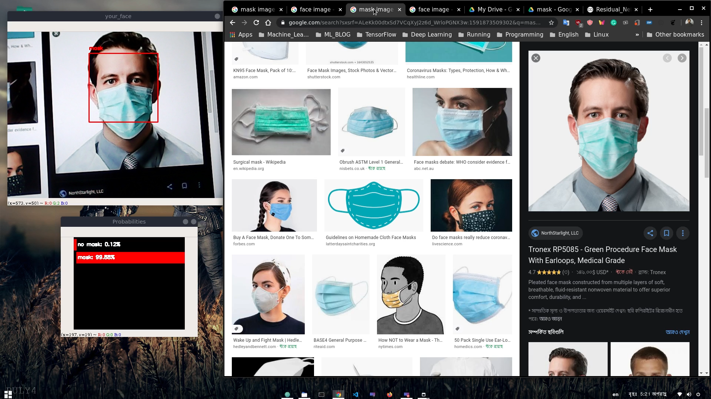
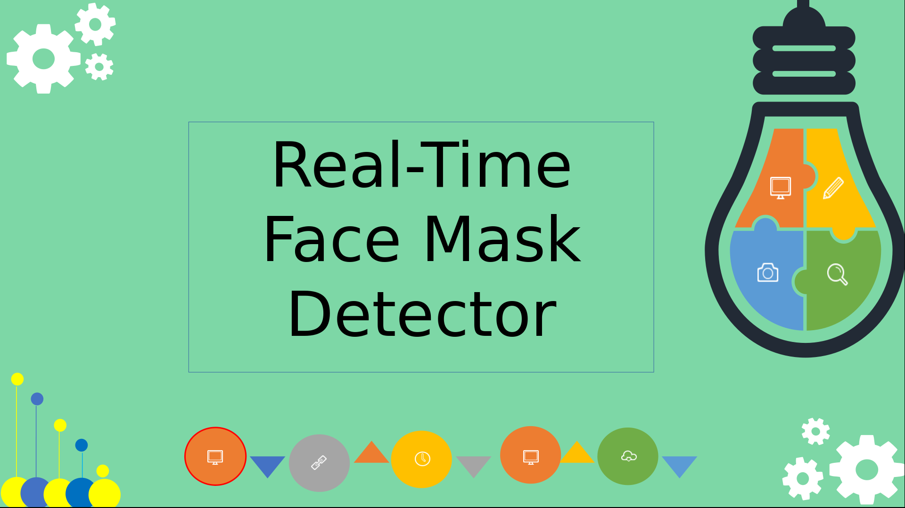

Learn how to create a real-time face mask detector using Tensorflow, Keras, and OpenCV with your webcam or mobile camera

## Introduction
This is a deep learning project. I used Convolutional Neural Networks to classify MNIST handwritten data. For more convenient propose of test data, used Tkinter to deploy a desktop app that can run any Os. You just need to select an image then all work done by this app. With this app anyone can apply image classification 

   
  <i>An example of Apps output.</i>

## Why CNN
In this project, Convolutional Neural Network(CNN) used as an image classifier. We used a pre-trained CNN model named ResNet50 to implement a transfer learning approach. We have two types of data face with mask and face with no mask. These two types of data are classified by the CNN model.

## Why App.py
We implement an open-cv based face detection model. By using OpenCV haarcascade_frontalface_default.xml file we extract face ROI from an image. Then the face ROI image fits it to the CNN model. Furthermore, like a binary classifier, the CNN model classifies whether the face ROI image is face with a mask or not. 

## How to use my code

With my code, you can:
* **Open cnn.ipynb => Train CNN model from scratch and save weight as h5 file**
* **Run App.py**

* **for more to know click the image below(youtube video) **

## Dependencies:

* **python 3**
* **Tensorflow**
* **Keras**
* **opencv (cv2)**
* **Numpy**
* **Pillow** 
* 

## Datasets:

I used 4 different datases: VOC2007, VOC2012, COCO2014 and COCO2017. Statistics of datasets I used for experiments is shown below

| Dataset                | Classes | #Train images/objects | #Validation images/objects |
|------------------------|:---------:|:-----------------------:|:----------------------------:|
| Own                    |    2      |      1200+              |           1200+             |

